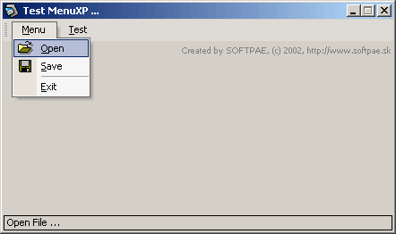



## XP Menu '2002 version 0\.12 \(alpha\)

### Description

This is the next alpha version of my XP Menu system. Removed some bugs, new function to add pictures, now you don't need any external OCX (ImageList) for menu, load pictures from resources, add simple top menubar, recreated as control, ... Work only in compiled exe, not in IDE, because it using hooking and resources, that not workin in debug mode.

See code at :

http://www.pscode.com/vb/scripts/ShowCode.asp?txtCodeId=33571&lngWId=1
 
### More Info
 

             |
---                |---
**Submitted On**   |
**By**             |[Anthonius](https://github.com/Planet-Source-Code/PSCIndex/blob/master/ByAuthor/anthonius.md)
**Level**          |Advanced
**User Rating**    |4.2 (25 globes from 6 users)
**Compatibility**  |VB 5\.0, VB 6\.0
**Category**       |[Custom Controls/ Forms/  Menus](https://github.com/Planet-Source-Code/PSCIndex/blob/master/ByCategory/custom-controls-forms-menus__1-4.md)
**World**          |[Visual Basic](https://github.com/Planet-Source-Code/PSCIndex/blob/master/ByWorld/visual-basic.md)
**Archive File**   |

### Source Code

http://www.pscode.com/vb/scripts/ShowCode.asp?txtCodeId=33571&lngWId=1

